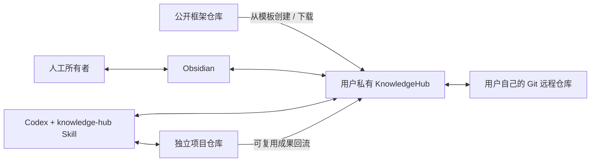

# KnowledgeHub Framework

一套可复制的、本地优先的个人知识库框架：Obsidian 负责人工阅读与最高权限修订，Codex 负责资料注入、整理、检索、审核、归档和 Git 同步。

> 框架是公开方法和工具；由框架创建的知识库实例保存用户自己的私有数据。



## 五分钟开始

1. 使用本仓库的 **Use this template** 创建一个新的私有仓库，或下载 Release ZIP。
2. 将新仓库克隆到本地。
3. 在仓库根目录运行：

   ```powershell
   powershell -ExecutionPolicy Bypass -File .\tools\setup.ps1
   ```

4. 在 Obsidian 中选择“打开本地文件夹作为仓库”。
5. 在 Codex 中打开同一个目录，然后直接用自然语言工作：

   ```text
   把这些 PDF 收进知识库，保留原始文件，建立来源记录并提取可复用知识。
   ```

如果系统没有 PowerShell，也可以直接使用目录模板；`setup.ps1` 只是负责补齐目录、Obsidian 推荐配置、Git/LFS 初始化和框架基线状态。

## 核心目录

| 目录 | 用途 |
| --- | --- |
| `00-Inbox/Human` | 人工尚未整理的输入 |
| `00-Inbox/Agents` | AI 尚未整理的输入 |
| `10-Sources` | 原始资料与来源记录 |
| `20-Knowledge` | 可长期复用的知识 |
| `30-Notes` | 思考和过程笔记 |
| `40-Courses` | 课程入口与上下文 |
| `50-Projects` | 独立项目入口与成果索引 |
| `60-Experiments` | 实验记录与证据 |
| `70-Outputs` | 报告、文章、演示等输出 |
| `90-Archive` | 软删除和历史归档 |

目录表达“资料是什么、处于什么阶段”；主题、课程、项目关系由元数据和链接表达。同一资料原则上只保存一份。

## 文档入口

- [快速开始](docs/快速开始.md)
- [日常使用](docs/日常使用.md)
- [独立仓库创建与驱动](docs/独立仓库创建与驱动.md)
- [框架原理与边界](docs/框架原理与边界.md)
- [升级与迁移](docs/升级与迁移.md)
- [演示场景](examples/demo/README.md)
- [其他用户通用落地包](https://github.com/MaybeToSure/KnowledgeHub-Setup)

## 安全边界

- 不要把真实资料提交到本公开框架仓库；应在由模板创建的个人实例中使用。
- 真实知识库远程仓库默认设为私有。
- 密钥、Token、密码、私钥和设备缓存不得提交。
- 项目代码使用独立仓库；知识库只保存稳定引用、上下文和可复用成果。
- 框架升级检测到用户改过的框架文件时会跳过并报告冲突，不会静默覆盖。

## 验证

```powershell
powershell -ExecutionPolicy Bypass -File .\tools\verify-repository.ps1
```

当前框架版本见 [`VERSION`](VERSION)。本项目采用 [MIT License](LICENSE)。
