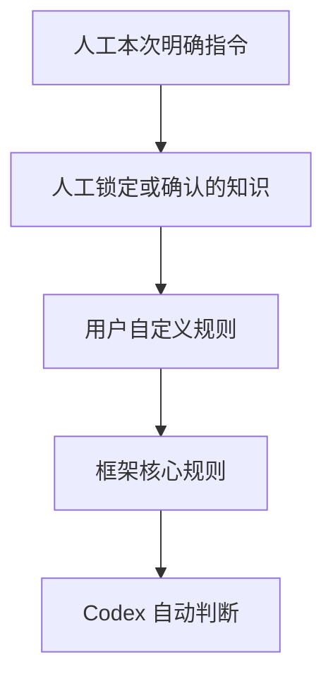
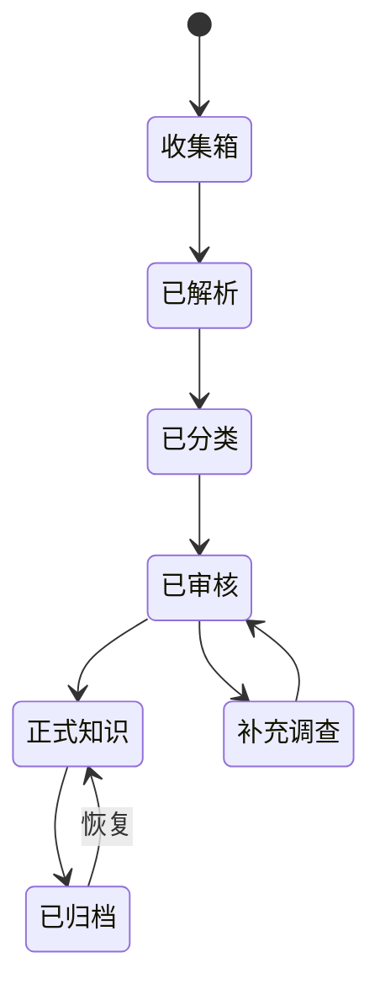

# 知识库治理

## 权威模型

人工自然语言指令可以覆盖默认规则，但只作用于明确指定的范围，除非人工要求更新全局规则。

## 知识类型

- `source`：原始资料及其来源记录。
- `knowledge`：可长期复用的事实、概念、方法或结论。
- `note`：尚在发展中的思考和过程记录。
- `course`：课程入口和课程上下文。
- `project`：独立项目的知识入口与成果索引。
- `experiment`：实验过程、证据、结果和结论。
- `output`：报告、文章、课件等交付成果。

## 生命周期

Codex 可以按治理规则推进普通知识条目状态。随手记是例外：必须遵守 `Rules/Core/随手记.md`，未经人工明确指令不得整理、汇总、分类、归档或转成行动。低置信度内容应保留来源和不确定性，不得伪装为确定事实。

## 不可破坏约束

- 原始资料不可静默覆盖；更新时保存新版本或派生笔记。
- 永久删除、强制推送、历史改写默认禁止。
- 批量变更前建立 Git 恢复点。
- AI 生成内容记录创建者、更新时间和来源。
- 人工锁定内容只允许人工明确授权后修改。
