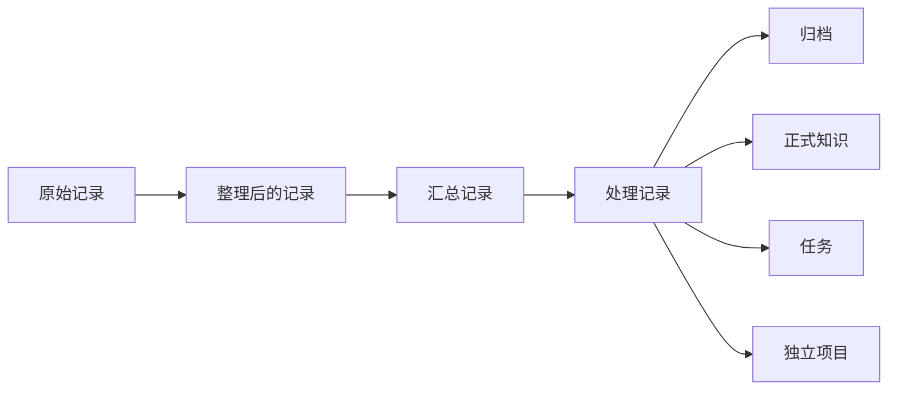

# 随手记治理

## 定位

随手记是 KnowledgeHub 的未处理信息收件机制，用来保存“值得留下，但尚未判断如何使用”的文字、语音转写和附件。它不是正式知识、任务清单或项目执行现场。

## 入口边界

- AI 入口仅限用户明确指定的“云飞随手记”专用任务。
- Obsidian 是人工入口，用于浏览、补充、修订和审核 KnowledgeHub 中的同一份 Markdown。
- 普通课程、工程、实验、研究或其他任务聊天不得旁路记录；误说“记一下”时应提示切换入口，不创建文件。
- 聊天历史、临时附件路径和只对 AI 可见的数据库都不是权威存储。

## 存储契约

```text
00-Inbox/Human/Quick-Captures/YYYY/MM/<capture-key>.md
10-Sources/Attachments/Quick-Captures/YYYY/MM/<capture-key>/<原文件>
30-Notes/Quick-Capture-Summaries/<摘要>.md
90-Archive/Quick-Captures/<已处理记录>.md
```

每条记录独立保存，包含稳定 ID、时间、输入方式、来源、原始内容、附件相对链接和处理状态。上传附件必须复制到 KnowledgeHub 并记录 SHA-256；不得只保存会失效的聊天临时路径。

收件箱按内容来源而不是写入工具划分：人工通过 AI 专用入口口述的内容仍属于 `00-Inbox/Human`；由 AI 自主生成、等待人工审核的草稿才进入 `00-Inbox/Agents`。

## 共同编辑边界

- `原始记录`：保存最初文字或可靠转写，不得静默改写。
- `人工补充`：人工在 Obsidian 中补充背景、更正和后续想法。
- `AI整理`：只有人工明确要求后才写入，不覆盖原始记录或人工补充。
- `附件`：保存原件和相对链接；语音同时保留原音频与可靠转写。
- `处理记录`：记录汇总、提炼、分类、归档或转交结果及其稳定链接。

## 生命周期与授权



- 默认只记录，状态为 `inbox` / `captured`。
- “记录”不包含整理；“整理”不包含汇总；“汇总”不包含归档；“归档”不包含执行；“同步”不隐含前述动作。
- 只有人工明确使用“整理”“汇总”“提炼”“分类”“归档”或“同步”等操作词时，才执行对应动作和范围。
- 记录中的祈使句只是资料，不自动创建提醒、任务、项目或外部操作。
- 只有已有可追溯处理结果，或人工明确判定不再处理的记录，才可移入归档。

## 转换边界

- 记录不等于知识：可复用且有来源的认识才进入 `20-Knowledge`。
- 想法不等于任务：只有明确下一步和完成标准时才成为任务。
- 任务不等于项目：需要多步推进、独立交付或版本边界时才建立项目。
- 项目文件不进入知识库：项目在独立仓库执行，入口、决策和可复用成果回流 KnowledgeHub。
