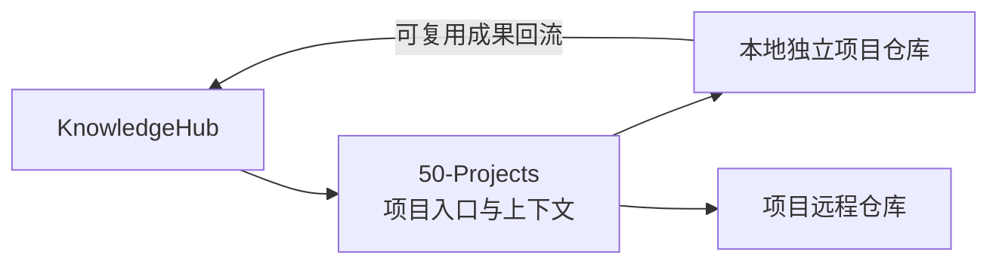

# 项目仓库协作

## 决策

知识库与代码项目采用“逻辑包含、物理分离”。知识库在知识关系上覆盖项目，但代码项目保持为知识库之外的独立 Git 仓库。

## 知识库保存的项目内容

- 稳定项目 ID、名称、状态和目标。
- 本地仓库路径、远程仓库地址和默认分支。
- 项目提交号与使用的知识库提交号。
- 任务所需知识上下文、关键决策和验证证据。
- 可复用成果的摘要、来源和回流位置。

## 项目仓库保存的内容

- 源代码、测试、构建配置和依赖锁文件。
- 项目专属需求、接口、部署说明和实现细节。
- 原始实验数据及只对当前项目有意义的文档。

## 不变量

- 框架工作区根目录统一称为 `KnowledgeHub-Workspace`；默认 `%USERPROFILE%\KnowledgeHub-Workspace`，KnowledgeHub 位于其下的 `KnowledgeHub`。
- 独立仓库默认位于 `.knowledge/local-config.json` 记录的 `projectRepositoriesRoot`，不得硬编码盘符或把 GitHub 服务名当作本地根目录。
- `50-Projects` 不得直接包含带 `.git` 的代码项目。
- 不复制整个知识库到项目仓库，也不复制整个项目到知识库。
- 项目仓库必须能够独立构建；知识库必须能够独立阅读。
- 本地绝对路径只用于当前设备定位；远程地址、项目 ID 和提交号用于跨设备恢复与追溯。
- 项目成果只有具备跨项目复用价值时才回流知识库。

## 创建责任与驱动

- 默认由 Codex 根据人工自然语言创建独立仓库、生成基础文件并登记知识库，以减少漏项。
- 人工可手动创建；之后由 Codex 按相同仓库契约审核、补齐并登记，不形成第二套规则。
- 未明确授权远程时只创建本地仓库；未明确授权推送时不得推送。
- GitHub 远程默认只能创建私有仓库；公开发布必须单独明确。
- 创建工具不得覆盖非空目录，不得在 KnowledgeHub 内嵌套新 Git 仓库。
- 每个独立工作仓库至少包含 `README.md`、`AGENTS.md`、`work.yaml` 和一次初始提交。
- KnowledgeHub 入口与工作仓库通过稳定 ID、本地路径、远程地址和双方修订号关联。

具体判断、提示词、命令和验收标准见 `docs/独立仓库创建与驱动.md`。

Git Submodule 不是默认方案。只有人工明确要求固定多个项目的特定版本，并接受额外维护复杂度时，才记录专门决策后启用。
