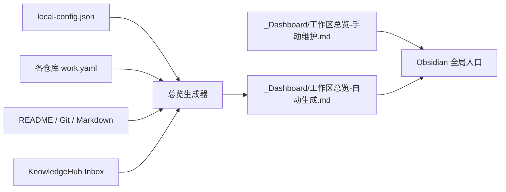

# 工作区总览

## 当前交付位置

- 当前输入：KnowledgeHub、受管理独立仓库和 Git 事实。
- 本工具目标：生成一个适合 Obsidian 阅读的全局入口。
- 下游产物：`_Dashboard/工作区总览-自动生成.md` 和 `_Dashboard/工作区总览-手动维护.md`，不复制或重写项目文档。



## 使用

在 KnowledgeHub 根目录运行：

```powershell
powershell -ExecutionPolicy Bypass -File .\tools\update-workspace-overview.ps1
```

也可以在已打开 KnowledgeHub 的 Codex 中说：

```text
更新工作区总览。
```

生成器只扫描 `projectRepositoriesRoot` 的直接子目录，并只纳入同时具有 `.git` 和 `work.yaml` 的仓库。这样不会把工作区中的普通文件夹或无关 Git 仓库擅自归入框架。

## Obsidian

为了让总览中的跨仓库内部链接生效，推荐把 `.knowledge/local-config.json` 中的 `workspaceRoot` 作为 Obsidian Vault。若只打开 KnowledgeHub 子目录，KnowledgeHub 内部内容仍可浏览，但项目仓库链接不属于该 Vault。

## 人工与生成内容

- `工作区总览-自动生成.md`：生成文件，不手工维护。
- `工作区总览-手动维护.md`：人工或经人工明确授权的 Codex 维护，生成器不会覆盖。
- 项目 README 和 docs：各项目仓库权威原文，Obsidian直接编辑原文件。

需要第二种视角时，再从同一事实增加独立生成页面；第一版不预建复杂仪表盘。
