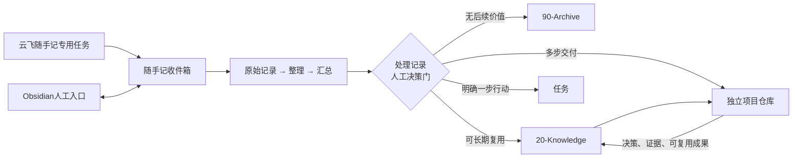

# KnowledgeHub 整体机制

## 1. 当前交付位置

- 当前输入：零散记录、原始资料、已形成知识和需要推进的目标。
- 机制目标：让记录、知识、任务和项目各自承担不同职责，又能完整追溯。
- 下游产物：可浏览的知识库、可执行的任务、独立项目仓库和可复用成果。

## 2. 总体结构

## 3. 四个职责层

| 层 | 解决的问题 | 权威位置 |
| --- | --- | --- |
| 随手记 | 先保留尚未判断的信息 | `00-Inbox/Human/Quick-Captures` |
| 知识库 | 建立长期意义、来源、关系和检索入口 | KnowledgeHub 编号目录 |
| 任务 | 明确下一步动作和完成标准 | 对应项目或任务系统 |
| 项目 | 围绕目标持续执行并形成交付物 | KnowledgeHub 外的独立 Git 仓库 |

“处理记录”是唯一转换门：它记录来源、人工决定、目标知识/任务/项目、状态和结果链接，防止 AI 把每个念头自动变成行动。

## 4. 人机协作

- 人工拥有最高权限，通过 Obsidian 阅读、补充、修订和审核。
- Codex 负责结构、元数据、关联、检索、审核、归档和经授权的 Git 操作。
- 云飞随手记只负责专用入口中的捕获和明确授权的后处理。
- 普通任务聊天保持主题纯净，不承担无关随手记。
- AI 与 Obsidian 操作同一份本地开放文件，不建立第二套权威数据。

## 5. 存储边界

- Markdown、规则、模板、索引条目和不可再生资料保存在本地 KnowledgeHub。
- PDF、图片、Office、音频等原件保存在 `10-Sources`，按需要使用 Git LFS。
- 项目代码、测试、依赖和项目专属文档留在独立仓库。
- Git 远程是版本化远程基线；敏感凭据不得进入任何仓库。

## 6. 验收标准

- 任一 AI 随手记都能在 Obsidian 中直接打开、补充和审核。
- 未经明确指令，随手记不会被整理、归档、转成任务或执行。
- 正式知识能够追溯来源；项目入口能够定位独立仓库和双方修订号。
- 全新克隆 KnowledgeHub 不会拉入项目代码，也不会丢失项目索引。
- 健康检查、Git 历史和归档路径提供可恢复证据。
