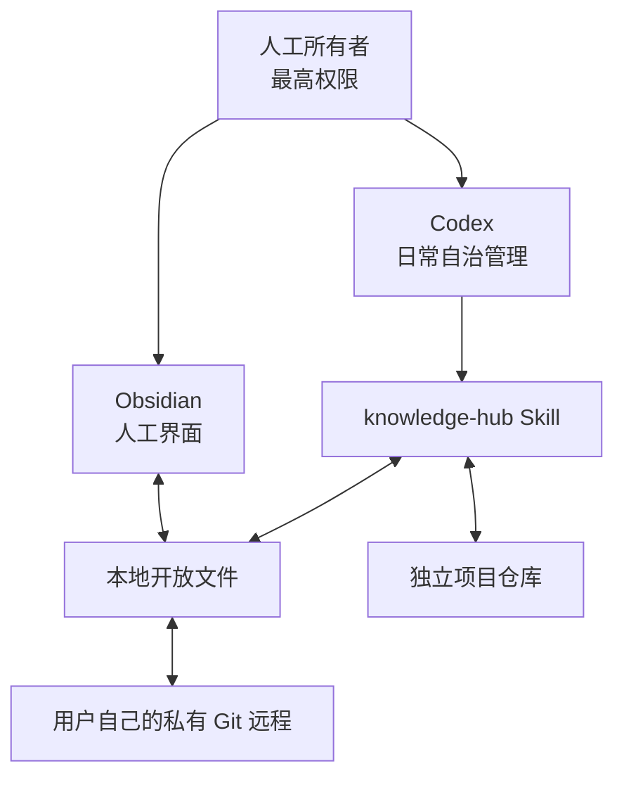

# 框架原理与边界

## 分层

## 权威顺序

1. 人工本次明确指令。
2. 人工锁定或确认的知识。
3. `Rules/Local` 中的用户规则。
4. `Rules/Core` 中的框架默认规则。
5. Codex 自动判断。

## 框架与数据的边界

框架管理 Skill、核心规则、基础模板和工具。用户拥有笔记、资料、项目索引、Obsidian 配置、自定义规则和自定义模板。

框架更新只处理 `framework.manifest.json` 声明的路径。更新工具通过上次安装时记录的哈希判断用户是否改过文件：未改动的文件可以更新；已改动的文件会跳过并报告冲突。

## 非目标

- 不把知识库做成只能由 AI 使用的专用数据库。
- 不要求人工记住复杂路径或角色命令。
- 不把所有代码项目嵌套到知识库。
- 不把 GitHub 当作唯一不可替代的数据恢复方案；它是版本化远程基线，用户仍应根据资料价值决定是否增加离线备份。
- 不自动提交、推送或发布任何内容，除非用户明确要求相应外部操作。
