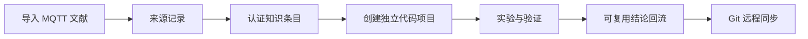

# 演示：从资料到代码项目再回流

这是一个不含真实资料的流程示例。

建议按顺序对 Codex 发出以下请求：

1. `把演示用的 MQTT 文献收进 10-Sources，创建来源记录。`
2. `从来源中提炼设备认证的可复用知识，区分原文事实和推断。`
3. `为 mqtt-auth-demo 创建项目入口，并在知识库外创建独立代码仓库。`
4. `使用知识条目组装项目最小上下文。`
5. `项目验证完成后，把可复用方法和证据回流知识库。`
6. `审核本轮新增内容并同步远程。`

预期结果：原始资料只保存一份；代码仓库不嵌套在知识库中；项目入口能够通过远程地址和提交号追溯双方版本。
